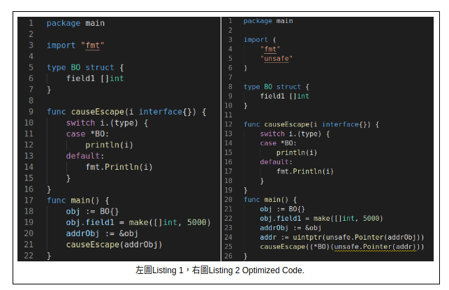
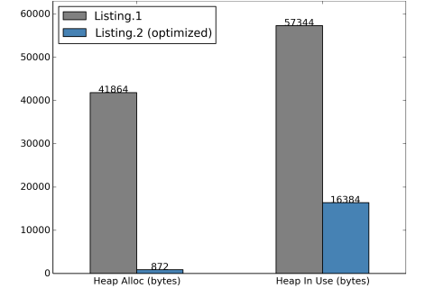

# [Golang]: 進階用法

主要介紹在 Golang 中相對進階的用法，如interface、reflection、Tag。善用這些技巧可以使得程式碼更加簡潔。ex, 透過 interface 的技巧使得 func 的參數更加有彈性；使用 reflection 進一步資料屬於的型態、甚至達到無須知道 type 也能夠修改資料; Tag 讓你 mapping 資料更加方便。

### Golang Interface

#### `Interface{} 型別轉換`

在Golang 中`Interface`資料結構是相當重要的，由於 Golang 屬於強型別語言，因此在func 中的 parameter 與 return value 時常會因為結構受限造成許多的不方便，然而`interface`就是來解決問題。(它本身可以是Golang 語言中任一 `type` 進而解決該問題。) [@in play ground](https://play.golang.org/p/zaGM7uRrL54)

```go showLineNumbers
package main

import (
	"fmt"
	"strconv"
)

type str string

func (s str) String() string {
	return string(s)
}

type Stringer interface {
	String() string
}

func ToString(any interface{}) string {
	if v, ok := any.(Stringer); ok {
		return v.String()
	}
	switch v := any.(type) {
	case int:
		return strconv.Itoa(v)
	case float64:
		return strconv.FormatFloat(v, 'g', -1, 64)
	}
	return "???"
}

func main() {
	var ex int = 1
	fmt.Println(ToString(ex))
	
	var ex2 float64 = 0.1
	fmt.Println(ToString(ex2))

	var ex3 Stringer = str("1")
	fmt.Println(ToString(ex3))
}

```

如上述程式碼，實作ToString 方法時，需要傳入各種型態(type)的參數，此時Interface 的彈性就派上用場了，藉由還原的語法進行實作，繞過強型別參數型態固定的問題。

#### `Interface{} 多形`

此外在Golang中若要做到 abstract method 的話則也需要 `interface`，它提供抽象方法的功能，並且可以在compile time 就能排除抽象方法實作上部份錯誤，ex. 少定義方法等...。換句話說，在Golang中實作`多型` 須仰賴`interface`。[@in play ground](https://play.golang.org/p/7QXmubY\_W7-)

```go showLineNumbers
package main

import (
	"fmt"
)


type Car interface {
	AddOil(gallon int)
	Run()
}

type VovoCar struct {
}

func (v *VovoCar) AddOil(gallon int) {
	fmt.Printf("vovo car add %d gallon\n", gallon)
}

func (v *VovoCar) Run() {
	fmt.Printf("vovo car add run\n")
}

type ToyotaCar struct {
}

func (t *ToyotaCar) AddOil(gallon int) {
	fmt.Printf("Toyota car add %d gallon\n", gallon)
}

func (t *ToyotaCar) Run() {
	fmt.Printf("Toyota car add run\n")
}

func main() {
	var c Car = &VovoCar{}
	var c2 Car = &ToyotaCar{}
	c.AddOil(10)
	c.Run()

	c2.AddOil(100)
	c2.Run()
}

```

### Golang Reflection

`Reflection` 是一種用於描述程式語言的工具。由於在Golang 中任何型別都可以是一種`Interface`，因此時常需要與`Reflection` 進行搭配，故筆者認為是一種`Interface`的配套工具。主要有三種用法：

* 映射出Interface 的資料型別 [@playground](https://play.golang.org/p/UVcH0UziXqQ)

```go showLineNumbers
package main

import (
	"fmt"
	"reflect"
)

type Example struct {}

func main() {
	fmt.Println(reflect.TypeOf(&Example{}))	// *main.Eaxmple
}

```

* &#x20;映射出Interface 的值 [@playground](https://play.golang.org/p/6Cyl-5xRV4t)

```go showLineNumbers
package main

import (
	"fmt"
	"reflect"
)

type Example struct {
	name string
}

func main() {
	val := reflect.ValueOf(&Example{ name: "Example name"}).Interface().(*Example) 
	fmt.Println(val) // &{Example name}
}
```

* 將某interface 資料注入到其他interface 中。 [@palyground](https://play.golang.org/p/N2wSMbc6R22)
  * 主要透過Call by Reference 的原理進行修改，因此dest 型態必須為`Ptr`。
  * 搭配`reflect.ValueOf.Elem.Field` 找出struct filed 的位置進而修改資料。

```go showLineNumbers
package main

import (
	"fmt"
	"reflect"
)

type Example struct {
	Id   string
	Name string
}

func ChangeValue(dest interface{}) {
	valDest := reflect.ValueOf(dest)

	for i := 0; i < valDest.Elem().NumField(); i++ {
		if i == 0 {
			valDest.Elem().Field(i).Set(reflect.ValueOf("change_id"))
		} else {
			valDest.Elem().Field(i).Set(reflect.ValueOf("change_name"))
		}
	}
}

func main() {
	destVal := &Example{Id: "test_id", Name: "test_name"}
	fmt.Println(destVal) // &{test_id test_name}
	ChangeValue(destVal)
	fmt.Println(destVal) // &{change_id change_name}
}

```

### Golang Tag

在Golang Struct 資料結構中，_**可自定義 Tag**_，有點類似於其他語言的Annotation，例如在判讀 Json 的Key 值時，須利用`` `json:" ``name`` "` ``的方式填入。然而在學習Golang 的初期時常會勿以為 Tag 是不可定義的，因為並不清楚如何取用。然而Reflection 工具此時就得到了一大作用，由於是描述程式語言的工具，因此可透過該工具將Tag 取出。[@playground](https://play.golang.org/p/jlsJMzriKzX)

```go showLineNumbers
package main

import (
	"fmt"
	"reflect"
)

type Example struct {
	Id string `json:"id"`
}

func main() {
	jsonExample := &Example{Id: "test"}
	field := reflect.TypeOf(*jsonExample).Field(0)
	fmt.Printf("name: %v ,tag:'%v'\n", field.Name, field.Tag) 
	// name: Id ,tag:'json:"id"'
}


```

### Golang 低階指標用法 ( uintptr, unsafe.Pointer)

在Golang 語言中除了正規的正常的寫法之外，也提供低階的程式設計模式，如可直接調用Unix 系統的C程式的cgo。但這種方式是不被建議使用的，因為直接調用很容易出現非預期的錯誤，除非特殊需要。若要Golang 中使用這一類低階的程式設計，則需宣告`import "unsafe"`字樣，語意上表示從外部匯入unsafe 套件，但實際上是由編譯器直接調用隱藏功能。`ex: net, syscall, os, runtime 等大多程式設計不太需要用到的。`

* **uintptr**  屬於Golang 基礎型態的一種，事實上是 Integer 型別，且可以接各種型態的指標。
* **unsafe.Pointer** 是將任何型別的東西轉換成`*ArbitraryType` 而 ArbitraryType 的定義為`type ArbitraryType int` ，因此實際上也是一種 Integer 型別。

#### Escape Analysis 演算法

指的是在編譯器端，對於程式碼編譯後，針對指標 (Pointer) 資料結構進行優化，並計算出需要多少的Heap 儲存。往往在Golang 中，時常使用到指標類型的結構，然而只要有該函式之外的呼叫，編譯器則會預先預先多配發空間，進而觸發GC(Grabage Collection)機制。

例如以下圖式為例: 單純透過指標的方式印出整數陣列，正規寫法如Listing 1 直接使用外部func 印出，優化做法透過 unsafe 的方式呼叫外部func。



在Golang中使用unsafe 直接調用Compile 的Pointer編譯器則不會預先產出Heap，也因此能避免該問題，**但壞處是可能會遇到預期之外的錯誤(**_**警語**_**)**。如上圖程式碼，都只是印出數字，但透過 unsafe pointer 調用的，使用的記憶體大小是預設的50倍，Heap 的大小是 3倍(下圖所示)。



### Reference

1. Wang, Cong, et al. "Escape from escape analysis of Golang." Proceedings of the ACM/IEEE 42nd International Conference on Software Engineering: Software Engineering in Practice. 2020.
2. [https://go.dev/blog/laws-of-reflection](https://go.dev/blog/laws-of-reflection)
3. [https://research.swtch.com/interfaces](https://research.swtch.com/interfaces)