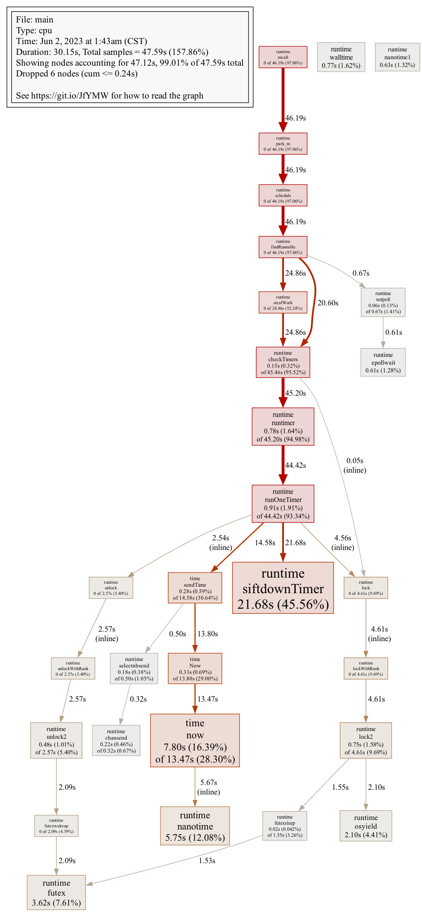
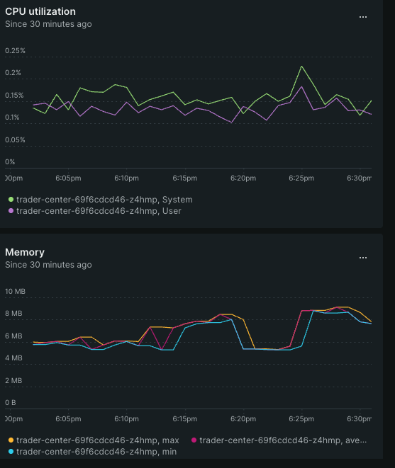
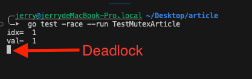
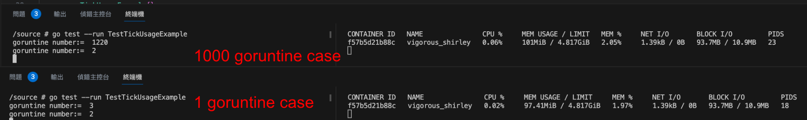
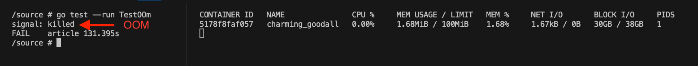
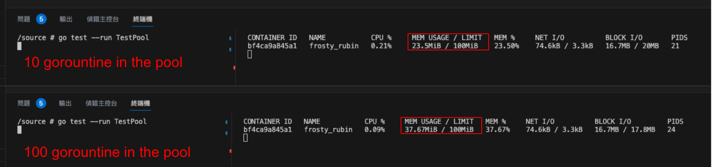

# [Golang] 讓 Goroutine Debug 變得更簡單

在進行多執行緒開發的時候，最害怕的遇到的四件事情：&#x20;

1. Deadlock: 
   process 之間都在等待資源釋出，但沒有process 可以釋出資源導致系統停擺
2.  CPU usage is high, but it is expected to be low:
    系統因為process 異常使用cpu，通常是由於goroutine 沒有被release 造成的堆積效應，使得預期cpu usage 應要降低，但卻維持高位
3.  RAM usage is high, but it is expected to be low.&#x20;
    造成原因通常有兩個，1. process 沒有正確的release 造成 CPU & RAM 使用率居高不下. 2. codebase design variable problem.
4.  Linux Out-Of-Memory Killer

    過度佔用 os 的 RAM，Process 會因為被系統判斷為不健康的程式，直接被系統刪除。常會在Database or Reverse proxy 使用上會出現。

這篇文章主要介紹，要如何避免上述狀況，以及要如何debug 的經驗分享。

### Debug Tools

* Golang tool <br/>
pprof 這是一個官方提供的工具，可以透過圖形的方式將Runtime 的程式進一步用圖形化的方式顯現，ex Gorountine counts, Memory usage by package 這些都相當方便，提供給大家參考。



* Monitor Tools
<br/>NewRelic: <br/>
這是一個類似 ELK 的 monitor，他可以很輕鬆的建置並偵測到 CPU & Memory 等 Matrix 的資訊，如果是自己的 side project 很推薦使用，因為他有 100GB 每月使用量，比起你自架來得省事省時間。但 ELK 也是很推薦，畢竟是 open source 但需要考慮的事情就會變多，ex database storage size, data rotation time, Infra Problems。



* Deployment Tools:<br/>
使用K8s, Docker 等等的工具進行deployment 是一個容易控管Program 的選擇，每種 Deployments 都有相應的 Health checking 機制，可以針對各種異常，進行緊急處理的機制。

## UseCases
實驗環境：使用Mac Book M1 Pro, 在 golang:1.19-alpine3.17 Container 中進行測試<br/>
以下舉例，容易造成問題的幾種用法：<br/>

#### Deadlock
* Golang Mutex use:在使用的過程中，容易會有double lock 的狀況，如下程式碼 ReadValue 在 UpdateValue 都在一開始使用時，就先lock 住，導致執行UpdateValue時，ReadValue無法成功被執行。

```go showLineNumbers
package article 

import (
	"fmt"
	"sync"
	"testing"
)

type MutexExample struct {
	lock   sync.Mutex
	ArrInt []int
}

func (m *MutexExample) UpdateValue(idx, val int) {
	m.lock.Lock()
	defer m.lock.Unlock()
	// here we are double lock
	v := m.ReadValue(idx)
	if v == 0 {
		m.InsetValue(val)
	} else {
		m.ArrInt[idx-1] = val
	}
}

func (m *MutexExample) InsetValue(val int) int {
	m.lock.Lock()
	defer m.lock.Unlock()
	m.ArrInt = append(m.ArrInt, val)
	return len(m.ArrInt)
}

func (m *MutexExample) ReadValue(idx int) int {
	m.lock.Lock()
	defer m.lock.Unlock()
	return m.ArrInt[idx-1]
}

func TestMutexArticle(t *testing.T) {
	m := &MutexExample{
		ArrInt: make([]int, 0),
	}
	idx := m.InsetValue(1)
	fmt.Println("idx= ", idx)
	val := m.ReadValue(idx)
	fmt.Println("val= ", val)

	m.UpdateValue(idx, 2)
}

```


* Golang Channel and Mutex Lock is interactive use
當mutex 跟 channel 一起使用的時候，容易造成互相等待導致deadlock 產生，func 保持單一職責原則，不要混著用導致deadlock 產生。

```go showLineNumbers
package article

import (
	"fmt"
	"sync"
	"testing"
)

type MutexChannelExample struct {
	lock    sync.Mutex
	ArrInt  []int
	updated chan bool
}

func (m *MutexChannelExample) InsetValue(val int) {
	m.lock.Lock()
	defer m.lock.Unlock()
	m.ArrInt = append(m.ArrInt, val)
	m.updated <- true
}

func (m *MutexChannelExample) ReadValue() int {
	m.lock.Lock()
	defer m.lock.Unlock()
	return m.ArrInt[len(m.ArrInt)-1]
}

func TestMutexChannelExample(t *testing.T) {
	m := &MutexChannelExample{
		ArrInt:  make([]int, 0),
		updated: make(chan bool),
	}
	go func() {
		for <-m.updated {
			// When m.ReadValue() is called, it will lock. However, in
			// line 44, m.InsetValue inputs a bool into the channel. 
			// Consequently, line 19 waits for the value to be 
			// retrieved and released, triggering another call to 
			// m.ReadValue(), which results in a deadlock.
			fmt.Println(m.ReadValue())
		}
	}()
	for i := 0; i < 10; i++ {
		m.InsetValue(i)
		fmt.Println("do once ===>")
	}
}
```


#### CPU & RAM usage is high, but it is expected to be low
* 在使用 Time 套件的時候，需要非常小心，以time.Tick為例，當他沒有被執行完成的時候，不會觸發 garbage recycle 所以cpu 不會被release 因此 cpu memory 都不會因為func結束而釋出資源

```go showLineNumbers
package article

import (
	"fmt"
	"runtime"
	"testing"
	"time"
)

type TickUsageExample struct {
}

func (e *TickUsageExample) RaiseGoroutine(c chan bool) {
	go func() {
		time.Sleep(time.Microsecond * 900)
		c <- true
	}()
	select {
	case <-time.Tick(time.Second):
		return
	case <-c:
		return
	}
}

func TestTickUsageExample(t *testing.T) {
	forever := make(chan bool)
	ex := TickUsageExample{}
	for i := 0; i < 1; i++ {
		go ex.RaiseGoroutine(make(chan bool))
	}
	fmt.Println("goruntine number:= ", runtime.NumGoroutine())
	time.Sleep(time.Second)
	fmt.Println("goruntine number:= ", runtime.NumGoroutine())
	<-forever
}
```




#### Linux Out-Of-Memory Killer

當我們使用記憶體，到達os 的上限的時候，linux os 會將最不健康的 process 刪除，因此要注要在使用`Goroutine`的時候，需要考慮到他的記憶體使用率，以免踩到！

```sh
docker run -it --rm -v $PWD:/source -m 100m  golang:1.19-alpine3.17 sh
```

```go showLineNumbers
package article

import "testing"

func TestOOm(t *testing.T) {
	for i := 0; i < 3; i++ {
		go func() {
			for true {
				var arr []string = make([]string, 100000)
				arr[0] = "test_str"
			}
		}()
	}
	forever := make(chan bool)
	<-forever
}
```



#### Better Practices
使用Goroutine時候，需使用 Gorountine Pool 去限制記憶體以及數量。 可以有效的管理 Func 的生命週期，以及 CPU, Memory 使用率，去避免 OOM 機制，不要使用time 去管理 Goroutine 而是使用context去管理就不會踩到 CPU、Memory 不會被 release 的問題。<br/>
以下方程式碼為例：這是一個使用 ant pool 的一個例子，line 14 宣告 pool size，從這裡可以有效的管理 CPU, Memory ，下方圖片的例子分別設定 10 和 100 size 的 pool，但跑一樣的一份程式碼，CPU, Memory Usage 是有相當大的差異。透過這樣的方式可以有效的避免 OOM 的機制的觸發。

```sh showLineNumbers
docker run -it --rm -v $PWD:/source -m 100m golang:1.19-alpine3.17 sh
```

```go showLineNumbers
package article

import (
	"sync"
	"testing"
	"time"

	"github.com/panjf2000/ants/v2"
)

func TestPool(t *testing.T) {
	var wg sync.WaitGroup
        // it can adjusted the pool size, expired_time, log... a lots of opts.
	pool, _ := ants.NewPool(10, ants.WithPreAlloc(true))
	for i := 0; i < 100; i++ {
		pool.Submit(func() {
			defer wg.Done()
			var arr []string = make([]string, 100000)
			arr[0] = "test_str"
			time.Sleep(time.Second * 10)
		})
		wg.Add(1)
	}
	wg.Wait()
}
```




#### Use to write the unit-test to find out the deadlock situation 
預防或者發現Deadlock的狀況，最簡單的方式就是透過 unit-test ，透過測試容易使得這一類問題提早發現。Deadlock 往往都是在真的 program 上線了之後才會發現有這樣的問題。 <br/>
How to find out: <br/>
1. Write the edge case for each func <br/>
撰寫Edge case test (極端測試) 在每一隻Goroutine程式，好處是可以去發現 deadlock的狀況，也比較能夠發現 Resource Usage (CPU, Memory) 的問題
2. Integration and Pression Test <br/>
整合測試與壓力測試實際上在軟體開發中非常重要，做這樣的測試的前提是，要使用 Monitor 工具，觀察每一個 Transaction (程式行為)的執行時間，還有執行片段。透過觀察Metrix的變化，是一個有效debug 的方式。 

## Reference
1. https://www.oracle.com/technical-resources/articles/it-infrastructure/dev-oom-killer.html