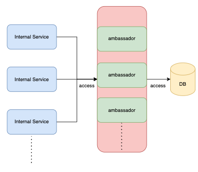
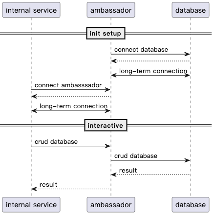
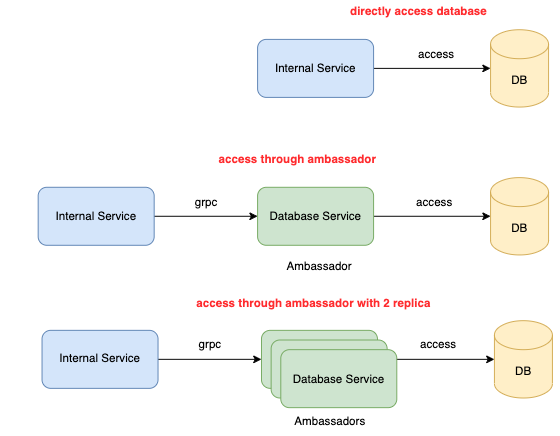
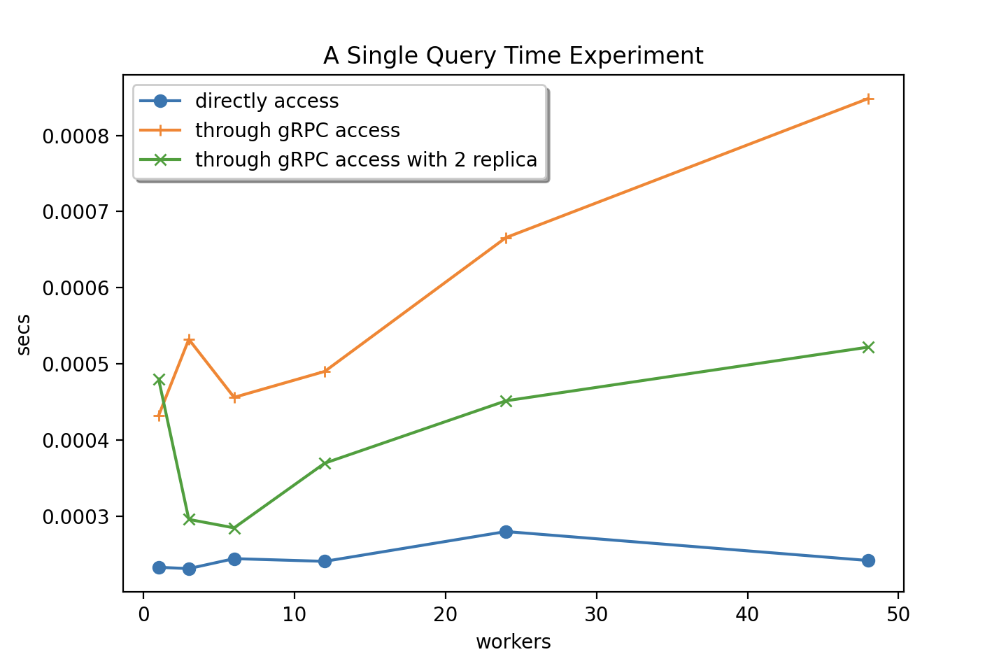

# Ambassador pattern with Shared Database Pattern

In Micro-Service architecture, the shared database pattern is popular. It does not let a service maintain a database by itself, instead of sharing the database between services. Because of the query issues and scalability issues such as Query, multiple data from multiple services and sometimes must do replication or sharded pattern [1]. But there are some force points in shared database pattern:

## Force points

1. Wasting Database Connection:  
The container connecting the database directly is not enough efficient, because the container does not access frequency. It always has idle time, but the database connection is precious[2].
2. The Database Connections have limits: 
It has a max connection count for a single node database, especially the RDBMS that only supports vertical scalability. ex: Microsoft Azure has a form to list the connection counts in each node and has different prices[3].
3. Security Issues:  
Each Container must access database so that is difficult to manage all implementation are safe.

## Structure

* Static Structure  
Internal service can access the database through Ambassador that can call the database service. In this way, the loading of the database shrift to the Ambassador because the Ambassador concrete the access demand from internal service.
Suggestions:  
1. Internal service access Ambassador with gRPC is better.
gRPC is an efficient tool that is based on HTTP2 and can compress a lot of connections into one connection. gRPC use protobuf that is convenient to export access interface to the others service.
2. Ambassador and database should bind in the same pod[4].

* Dynamic Structure

There are two phases on dynamic structure. 
**Init Phase** 
In this phase, the Ambassador builds a long-term connection to the database and internal services build a long-term connection to Ambassador. 
**Interactive Phase** 
The ambassador is a middleware for the internal service access database that passes the command or queries to the database and then passes the result back 

## Pros and Cons:
**Pros** 
* Reduce the database connection pressure
* Provide a uniform interface for accessing the database to reduce duplicated implementation
* More efficient to use a database connection
* Safer than every service can directly access
* More easier add cache data 

**Cons** 
* The access time will increase than no ambassador access time

## Experiments

* Hardware: m1 pro cpu (8 core), 16 GB RAM and 512 SSD.  
Environments: MySQL(mysql:8.0.31), Application Run (golang:1.19.2-alpine3.16) in docker.
* The Experiment Architecture:  
A internal service directly access and internal service access database through database.

* The Experiment of measuring the query time
In the experiment, We want to know how different access between gRPC and direct access is. So that we measure a single time by 150000 times query with 1, 3, 6, 12, 24 and 48 workers in a single connector, and we take an average in 10 experiments.

* We found in the result: 
In this pattern, a bottleneck is gRPC throughput but can be solved by a replica node. It easily found the problem by the below formula that is a roundtrip of gRPC (query/response).

$$ 
    QueryTime = grpcTime*2 + dbQueryTime 
$$
## Conclusion
According to the result of the experiment, we can find the max gap time between direct access and through gRPC access is 0.0005 is a small value. If the speed wants to accelerate, only increase the replica node. So this pattern has horizon scalability and vertical scalability that can solve shared database pattern deployment problems only sacrificing a bit of performance.

## Reference

[1] micro service pattern shared database pattern, https://microservices.io/patterns/data/shared-database.html 
[2] Fowler, Martin. Patterns of Enterprise Application Architecture: Pattern Enterpr Applica Arch. Addison-Wesley, 2012. 
[3] Limits in Azure Database for PostgreSQL - Single Server, https://learn.microsoft.com/en-us/azure/postgresql/single-server/concepts-limits 
[4] ambassador pattern, https://learn.microsoft.com/en-us/azure/architecture/patterns/ambassador 
